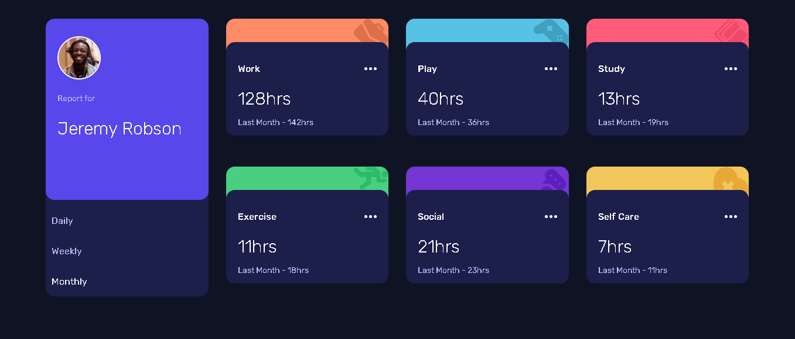
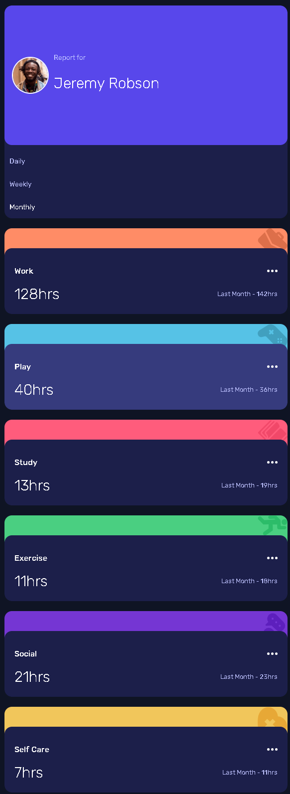

# Time Tracking Dashboard

Bu proje, basit ama işlevsel bir zaman takip arayüzü (Time Tracking Dashboard) olarak geliştirilmiştir. **Daily**, **Weekly**, **Monthly** filtreleri ve kategori bazlı kart tasarımı ile kullanıcıların aktivitelerini takip etmelerine olanak tanır.

## 🎯 Proje Amacı ve Kapsam

Bu çalışma, 2025 Yaz Dönemi Meslek Stajım kapsamında **GET Yazılım** firmasında yürüttüğüm proje doğrultusunda hazırlanmıştır. Amaç, temel web teknolojileri (HTML, CSS, Bootstrap) kullanarak pixel-perfect ve responsive bir dashboard tasarımı becerilerimi geliştirmektir.

## 🔗 Canlı Demo

Projeyi canlı olarak görmek için GitHub Pages üzerinden yayınladım:

[🔗 Canlı Demoyu Görüntüle](https://YunusSakal.github.io/time-tracking-dashboard/)

---

### 🖥️ Masaüstü Görünümü

### 📱 Mobil Görünümü

---

## 🛠️ Kullanılan Teknolojiler

- **HTML5**  
- **Bootstrap 5** (Grid ve temel bileşenler)  
- **CSS3** (Sade, amator stilde özelleştirmeler)  
- **Google Fonts** (Rubik)

---

## ✨ Tasarım ve Özellikler

- **Responsive Tasarım**: Grid sistemi sayesinde masaüstü, tablet ve mobilde sorunsuz çalışır.  
- **Filtre Butonları**: Active state ile Daily/Weekly/Monthly geçişleri.  
- **Kategori Kartları**: Renkli başlık çubukları ve ikonlarla Work, Play, Study, Exercise, Social, Self Care kategorileri.  
- **Basit Animasyon**: Hover durumunda kartlar hafifçe yükselir ve gölge efektleri.

---

## 👨‍💻 Geliştirici

**Mehmet Yunus Sakal**  
Muğla Sıtkı Koçman Üniversitesi – Bilişim Sistemleri Mühendisliği  
**GET Yazılım** – 2025 Yaz Dönemi Stajyeri  

- 🔗 GitHub: [github.com/YunusSakal](https://github.com/YunusSakal)  
- 🔗 LinkedIn: [linkedin.com/in/yunus-sakal-92961229a](https://www.linkedin.com/in/yunus-sakal-92961229a)

